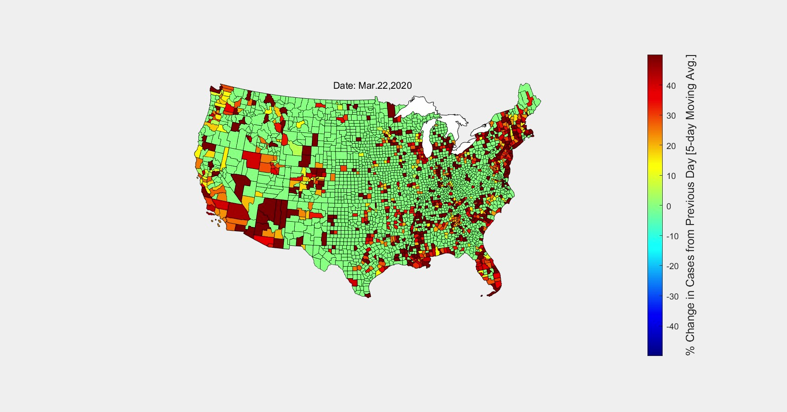

# COVID-19 Data Visualization with Video Animation

Author: Kevin Montes

Email: kjmontes1@gmail.com

[ [U.S. Data](us.csv) ([Raw CSV](https://raw.githubusercontent.com/nytimes/covid-19-data/master/us.csv)) | [U.S. State-Level Data](us-states.csv) ([Raw CSV](https://raw.githubusercontent.com/nytimes/covid-19-data/master/us-states.csv)) | [U.S. County-Level Data](us-counties.csv) ([Raw CSV](https://raw.githubusercontent.com/nytimes/covid-19-data/master/us-counties.csv)) ]

This repository has been forked from the [original New York Times repository](https://github.com/nytimes/covid-19-data) of the same name. Additional information about the datasets of COVID-19 cases and deaths can be found there in the 'README.md', including information about formatting, methodology, and licensing. The most up-to-date datasets can also be found there or at the links above.

The code in this repository also relies on the geographic county data available [here](https://www.sciencebase.gov/catalog/item/52c79543e4b060b9ebca5bf4) in order to render geographical projections of county boundaries. The 'tl_2012_us_county.zip' should be downloaded into the repo before running any of the scripts. 

The MATLAB scripts here were developed and tested with MATLAB version R2019b. They can be used to make a video animation of the case and death data located in the 'us-counties.csv' file. To plot, simply run the 'plot_usa_counties.m' script. It is written in a way to support plotting other quantities, as any user can write their own function that can be called by the main routine. Two examples of this are shown in the 'get_cases_per_area.m' and 'get_daily_new_cases.m' files.

Data has also been compiled by Jordan Allen, Jeff Arnold, Aliza Aufrichtig, Mike Baker, Robin Berjon, Matthew Bloch, Nicholas Bogel-Burroughs, Maddie Burakoff, Christopher Calabrese, Andrew Chavez, Robert Chiarito, Carmen Cincotti, Alastair Coote, Matt Craig, John Eligon, Tiff Fehr, Andrew Fischer, Matt Furber, Rich Harris, Lauryn Higgins, Jake Holland, Will Houp, Jon Huang, Danya Issawi, Jacob LaGesse, Hugh Mandeville, Patricia Mazzei, Allison McCann, Jesse McKinley, Miles McKinley, Sarah Mervosh, Andrea Michelson, Blacki Migliozzi, Steven Moity, Richard A. Oppel Jr., Jugal K. Patel, Nina Pavlich, Azi Paybarah, Sean Plambeck, Carrie Price, Scott Reinhard, Thomas Rivas, James G. Robinson, Michael Robles, Alison Saldanha, Alex Schwartz, Libby Seline, Shelly Seroussi, Rachel Shorey, Anjali Singhvi, Charlie Smart, Ben Smithgall, Steven Speicher, Michael Strickland, Albert Sun, Thu Trinh, Tracey Tully, Maura Turcotte, Bella Virgilio, Miles Watkins, Phil Wells, Jeremy White, Josh Williams, Jin Wu and Yanxing Yang.
>>>>>>> upstream/master
